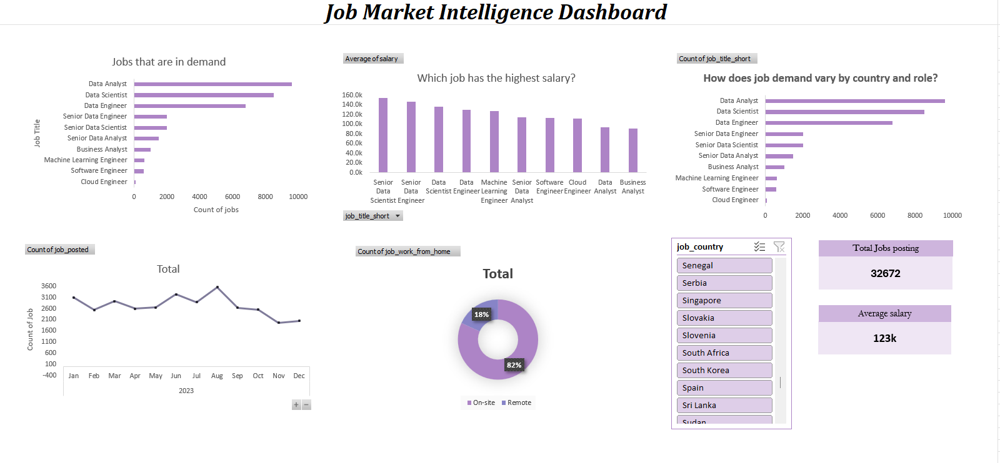

Job Market Intelligence Dashboard

An interactive Excel dashboard analyzing global job market trends across roles, countries, salary levels, and remote work distribution.

Project Overview

This dashboard answers key business questions:

- Which job roles dominate the market?
- Which roles earn the highest salaries?
- How does job demand vary by country?
- Is job demand increasing over time?
- What is the distribution of remote vs on-site jobs?

Dashboard Preview

Tools Used

- Microsoft Excel
- Pivot Tables
- Pivot Charts
- Slicers
- KPI Cards
- Date Grouping (Year & Month)
- Interactive Dashboard Design

Key Insights

- Data Analyst and Data Scientist roles dominate global demand.
- Senior roles command significantly higher salaries.
- Remote work represents a large portion of postings.
- Demand fluctuates across months, showing seasonal variation.

Skills Demonstrated

- Data analysis
- Dashboard design
- Business storytelling
- Interactive reporting
- Excel-based Business Intelligence
